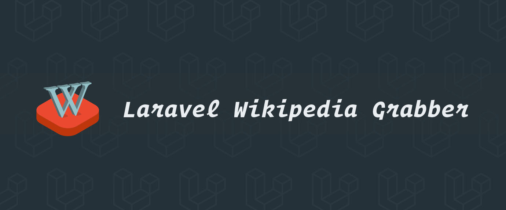

# Laravel Wikipedia Grabber

[](https://patreon.com/dmitryivanov)

[](https://styleci.io/repos/117998599)
[](https://travis-ci.com/dmitry-ivanov/laravel-wikipedia-grabber)
[](https://coveralls.io/github/dmitry-ivanov/laravel-wikipedia-grabber?branch=master)

[](https://packagist.org/packages/illuminated/wikipedia-grabber)
[](https://packagist.org/packages/illuminated/wikipedia-grabber)
[](https://packagist.org/packages/illuminated/wikipedia-grabber)
[](https://packagist.org/packages/illuminated/wikipedia-grabber)

Wikipedia/MediaWiki Grabber for Laravel.

| Laravel | Wikipedia Grabber                                                            |
| ------- | :--------------------------------------------------------------------------: |
| 7.x     | [7.x](https://github.com/dmitry-ivanov/laravel-wikipedia-grabber/tree/7.x)   |
| 6.x     | [6.x](https://github.com/dmitry-ivanov/laravel-wikipedia-grabber/tree/6.x)   |
| 5.8.*   | [5.8.*](https://github.com/dmitry-ivanov/laravel-wikipedia-grabber/tree/5.8) |
| 5.7.*   | [5.7.*](https://github.com/dmitry-ivanov/laravel-wikipedia-grabber/tree/5.7) |
| 5.6.*   | [5.6.*](https://github.com/dmitry-ivanov/laravel-wikipedia-grabber/tree/5.6) |
| 5.5.*   | [5.5.*](https://github.com/dmitry-ivanov/laravel-wikipedia-grabber/tree/5.5) |


## Table of contents

- [Usage](#usage)
- [Output formats](#output-formats)
- [Available methods](#available-methods)
- [Advanced](#advanced)
  - [MediaWiki](#mediawiki)
  - [Modify the grabbed page](#modify-the-grabbed-page)
- [License](#license)

## Usage

1. Install the package via Composer:

    ```shell script
    composer require illuminated/wikipedia-grabber
    ```

2. Publish the config:

    ```shell script
    php artisan vendor:publish --provider="Illuminated\Wikipedia\WikipediaGrabberServiceProvider"
    ```

3. Grab a full page or preview:

    ```php
    use Wikipedia;

    echo (new Wikipedia)->page('Michael Jackson');
    echo (new Wikipedia)->preview('Michael Jackson');

    // Or

    echo (new Wikipedia)->randomPage();
    echo (new Wikipedia)->randomPreview();
    ```

## Output formats

Here's the list of supported output formats:

- `plain` (default)
- `bootstrap`
- `bulma`

Change the format in your config file, or specify it explicitly:

```php
echo (new Wikipedia)->page('Michael Jackson')->bulma();
```

## Available methods

When you call the `page()` or `preview()` method, you'll get an instance of the proper object.

There are numerous methods available on these objects, for example:

```php
$page = (new Wikipedia)->page('Michael Jackson');

$page->isSuccess();         // true
$page->isMissing();         // false
$page->isInvalid();         // false
$page->isDisambiguation();  // false

echo $page->getId();        // 14995351
echo $page->getTitle();     // "Michael Jackson"
echo $page->getBody();      // Same as `echo $page;`
```

## Advanced

### MediaWiki

Wikipedia uses the [MediaWiki API](https://mediawiki.org/wiki/API:Main_page) under the hood.

Thus, you can grab pages from any MediaWiki website:

```php
use MediaWiki;

echo (new MediaWiki($url))->page('Michael Jackson');
```

### Modify the grabbed page

Sometimes it might be useful to append additional sections to the grabbed page:

```php
$page = (new Wikipedia)->page('Michael Jackson');

$page->append('Interesting Facts', 'He had two pet llamas on his ranch called Lola and Louis.');
```

Alternatively, you can get the sections collection and change it as needed:

```php
$page = (new Wikipedia)->page('Michael Jackson');

$sections = $page->getSections();
$sections->push(
    new Section('Interesting Facts', 'He had two pet llamas on his ranch called Lola and Louis.', $level = 2)
);
```

## License

Laravel Wikipedia Grabber is open-sourced software licensed under the [MIT license](LICENSE.md).

[](https://patreon.com/dmitryivanov)
